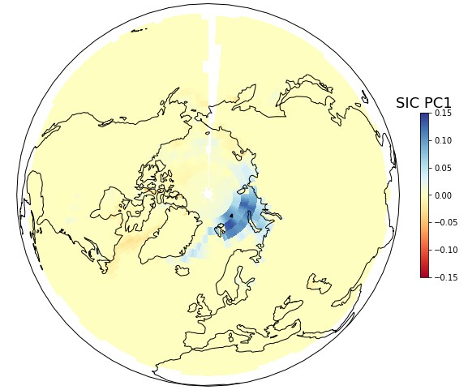
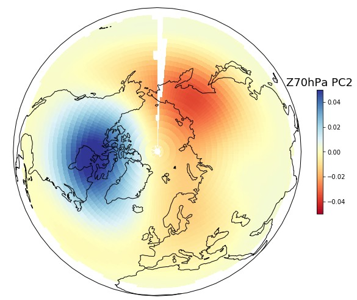
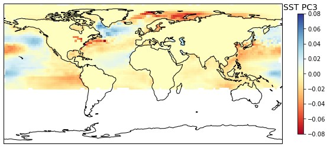

# Winter Predictor
## Background
Can we predict future winter average temperatures in the Northern Hemisphere one month in advance? Where are average temperature more likely to be extreme? The challenge of seasonal forecasting is typically addressed with numerical simulations based on physics and empirical parametrization of sub-grid cells processes. While widespread, this approach is computationally expensive and requires solid meteorological modeling knowledge. In contrast, we adopt here a purely statistical approach which is computationally cheap and relates temperature anomalies to spatial and temporal patterns of typical weather.

When starting this project, I had a few goals in mind:

* Set-up a prototype for a winter hedge product, i.e. guess which meteorological stations will have maximal payouts in “Heating Degree Days” option-like weather certificates.
* Create a flexible technical environment that will serve as a testbed for several machine learning experiments. 
* Illustrate how databases can efficiently be used in climate research.

## Structure of the project

The project consists of three phases:

1. Data download and ingestion into MongoDB.
2. Construction of the predictors.
3. Seasonal prediction.

The project includes three directories, which are described below:

* `pred`: contains the python classes necessary to download the station and reanalysis data.
* `scripts`: contains the scipts to be executed.
* `env`: contains the files necessary to create a virtual environment dedicated to this project.
* `data`: contains various files, e.g., configuration, plots, etc.
* `dev`: contains development files, e.g., jupyter-notebooks, etc.

## Prerequisites <a name="prerequisites"></a>

* Per default, it is assumed that the user has access to a running MongoDB database service. Please review and modify the access configuration file at `data/config.json`. Access Control can be defined in Mongo shell following [these](https://docs.mongodb.com/manual/tutorial/enable-authentication/) instructions.
* All necessary Python packages can be installed in a [pipenv](https://docs.pipenv.org/) virtual environment (venv). The Pipfile is located in [env/Pipfile](env/Pipfile). In order to setup the venv:
    * Install [pipenv](https://docs.pipenv.org/).
    * Go to the 'env/' directory and execute `pipenv install`.
    * In order to activate the venv, execute `pipenv shell` from the `env/` directory.

## Scientific background
This work is based on the study of [Wang et al. (2017)](https://www.nature.com/articles/s41598-017-00353-y). The authors have shown that autumn patterns of sea-ice concentration (SIC), stratospheric circulation (SC) and sea surface temperature (SST) are closely related to the winter Norther Atlantic Oscillation (NAO) index. Using linear regressions and Principal Component Analysis (PCA), I managed to reproduce the following central result of this study: principal component scores of **SIC, SC and SST patterns explain roughly 57% of the average winter NAO index**. Next, I have extended this methodology at the spatial scale of individual stations.


The following figures show the principal component patterns for sea-ice concentration (Figure 1, first loading), stratospheric circulation (Figure 2, second loading) and sea surface temperature (Figure 3, third loading). The combined amplitudes of these patterns are related to temperature anomalies in the northern hemisphere.



Figure 1: Leading principal component for sea-ice concentration (SIC) in autumn. This mode features patterns localized in the Barents and Kara Seas during the freezing season and explains 13.3% of SIC variability. 



Figure 2: Second principal component of stratospheric circulation (Z70hPa). This mode exhibits a bipolar pattern over eastern Siberia and northern Canada and explains 9.8% of stratospheric circulation variability in autumn. Its positive phase is characterized by an eastward shift of the polar vortex. 




Figure 3: Third principal component of sea surface temperature (SST). This mode shows a tri-polar pattern in the Northern Atlantic sector (a warm center in mid-latitudes and cold anomalies on the tropical and polar sides) and explains 5.2% of SST variability in autumn.

## (1) Data download and ingestion into MongoDB

Quick summary of the datasets:

* **Station dataset**: monthly station measurements for average monthly temperature (i.e. our _“ground truth”_) come from the [GHCN](https://www.ncdc.noaa.gov/ghcn-daily-description) dataset. More details are given in the [README_GHCN_MONTHLY.md](README_GHCN_MONTHLY.md) file.
* **Grid dataset**: monthly sea-ice concentration, stratospheric circulation (Z70 hPa), sea surface temperature and other variables are provided by the [ERA5T](https://cds.climate.copernicus.eu/cdsapp#!/dataset/reanalysis-era5-pressure-levels-monthly-means?tab=overview) re-analysis dataset. More details are given in the [README_ERA5T_MONTHLY.md](README_ERA5T_MONTHLY.md) file.

Given that you already have a MongoDB instance running (per default locally) and with all required python package installed (see [Prerequisites](#prerequisites)), source and ingest (or update) both datasets by executing the following commands:

1. `cd env/ && pipenv shell && cd ..`
2. `python script/01_ghcn_monthly_feed.py`
3. `python script/02_era5T_feed.py`


### Summary data collections

In MongoDB, the data is stored in the following two collections:


| Description | Database name| Collection name|
|:-------------|:-------------|:-----|
|GHCNM stations | GHCNM |stations|
|GHCNM data| GHCNM |dat|
|ERA5t grid| ERA5t |grid|
|ERA5t data| ERA5t |dat|

### Monthly GHCN station dataset

For all details, check [README_GHCN_MONTHLY.md](README_GHCN_MONTHLY.md)

The [GHCN](https://www.ncdc.noaa.gov/data-access/land-based-station-data/land-based-datasets/global-historical-climatology-network-ghcn) database contains two collections, one recording the location and the name of the stations, one other containing the time series of monthly average temperature (TAVG). A typical station document in MongoDB looks like this:

```
{'_id': ObjectId('...'), 
'station_id': 12345, 
'name': 'Zürich', 
'loc': {'coordinates': [8.54, 47.38], 'type': 'Point'}, 
'country': 'Switzerland', 
(…), 
'wmo_id': 789}
```

A typical monthly station data document contains monthly observations and looks like:

```
{‘_id’: ObjectId(‘...’), 
‘station_id’: 2345, 
‘variable’: ‘TAVG’, 
‘year’: 2017, 
‘january’: 2.9, 
(…), 
‘december’: 3.2}
```


### Monthly ERA5T reanalysis dataset
For all details, check [README_ERA5T_MONTHLY.md](README_ERA5T_MONTHLY.md)

The [ERA5T](https://confluence.ecmwf.int/display/CKB/ERA5%3A+data+documentation) database contains two collections: one containing the grid cell locations and a second collection containing the monthly time series. A typical grid document is spatially indexed and looks like this:

```
{'_id': ObjectId('...'), 
 'id_grid': 1, 
 'loc': {
 'coordinates': [-180.0, 90.0], 
 'type': 'Point'}}
```
 
A typical re-analysis monthly data document has indexes put on the date and grid_id and looks like this:

```
{'_id': ObjectId('...'),  
'date': datetime.datetime(1995, 1, 1, 0, 0),  
'id_grid': 1, …, 
'ci': 1.0, 
'sp': 102342.02, 
'sst': 271.46, 
'z70': 168316.99}
```

The stored variable are:

| Abbreviation | Variable name|
|:-------------|:-------------|
| ci | [Sea-ice cover](https://apps.ecmwf.int/codes/grib/param-db?id=31) (0-1)|
| sp | [Surface pressure](https://apps.ecmwf.int/codes/grib/param-db?id=134) (Pa) |
| sst | [Sea surface temperature](https://apps.ecmwf.int/codes/grib/param-db?id=34) (K) |
| z70 | [Geopotential height at 70 hPa height](https://apps.ecmwf.int/codes/grib/param-db?id=129) (m²/s²)|


**Important**: You need to use ECMWF's API in order to download ERA5 data. Read [CDS API documentations](https://cds.climate.copernicus.eu/api-how-to) for more details. In short, a (free) registration to Copernicus and the setting of ECMWF's API are required. Both steps are easily done. Read the [README_ERA5T_MONTHLY.md](README_ERA5T_MONTHLY.md) file for more details.


## (2) Construction of the predictors
We follow Wang et al. (2017) and perform a Principal Component Analysis (PCA) of several ERA-interim variables.

* era-int_pca_exploration.ipynb : _exploration and visualization of the main modes of variability for SIC, SC, SST._
* winter_predictor.py : _the class “Predictor” builds the predictor based on any ERA-interim variable._


## (3) Seasonal prediction
The first step is to reproduce the central result of Wang et al. (2017) and predict the Northern Atlantic Oscillation (NAO) index using linear regression and features selection.

Code:

* era-int_NAO_definition.ipynb : _definition and calculation of NAO index time series._
* era-int_NAO_prediction.ipynb : _lasso regression of NAO index based on all PC scores._

Next, we apply the same methodology for each individual stations. We seek stations that are both predictable (i.e. high adjusted R² score) and that will show large temperature anomalies for the next winter. 

Code:

* winter_predictor.py : _this is the main code of this project. It contains a two classes: (i) a class “Predictor” that prepares covariate candidates for the regression and (ii) another class StationPrediction that perform the seasonal prediction at the station-level._
* winter_predictor.ipynb : _illustrates the use of the classes mentioned above._
* scan.py: _this script scans all stations and spots those that have both high predictability (i.e. R²>0.5) that will experience a large seasonal deviation._

## (4) Additional files
* input.csv: _contains the list of countries where the analysis is to be conducted_

## (5) To do list:
* Latest stand: createRow: Decide how to store data: all year in one array?
* For comments: era5T.py. Working on the creation of the grid collection. Function created, now integrate it into the workflow in processYear and init.
* Work on the download API funtion getFiles. On 2021-05-06, loading 2021-04z70hPa worked. Now go on with other variables, ci, etc. Check [this link](https://cds.climate.copernicus.eu/cdsapp#!/dataset/reanalysis-era5-single-levels-monthly-means?tab=form) also.

* Predict PCA scores of next winter avg temp using PCA scores of ci, sp, sst, z70, etc.
