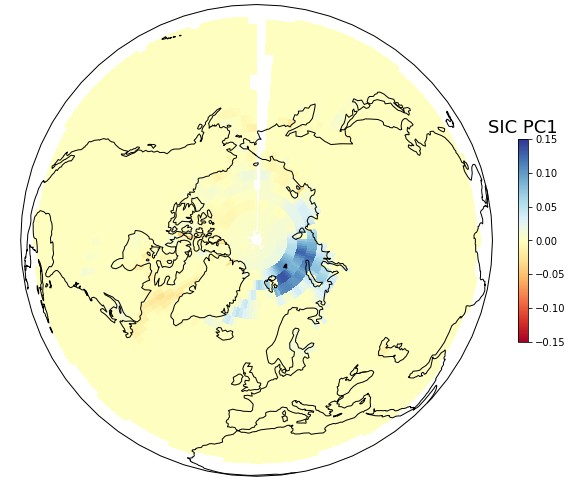
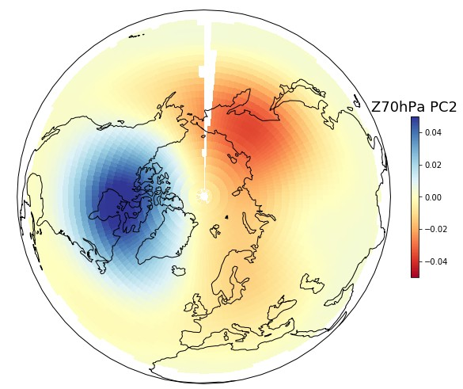
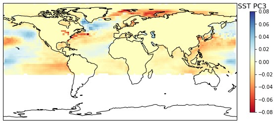

# Winter Predictor
## Description
Can we predict future winter average temperatures in the Northern Hemisphere one month in advance? Where are average temperature more likely to be extreme? The challenge of seasonal forecasting is typically addressed with numerical simulations based on physics and empirical parametrization of sub-grid cells processes. While widespread, this approach is computationally expensive and requires solid meteorological modeling knowledge. In contrast, we adopt here a purely statistical approach which is computationally cheap and relates temperature anomalies to spatial and temporal patterns of typical weather.

When starting this project, I had a few goals in mind:

* Set-up a prototype for a winter hedge product, i.e. guess which meteorological stations will have maximal payouts in “Heating Degree Days” option-like weather certificates.
* Illustrate how MongoDB can be used in climate research.
* Improve my knowledge of Python. As by 2017 I was proficient in R but not yet in Python.

This work is based on the work of [Wang et al. (2017)](https://www.nature.com/articles/s41598-017-00353-y). The authors have shown that autumn patterns of sea-ice concentration (SIC), stratospheric circulation (SC) and sea surface temperature (SST) are closely related to the winter Norther Atlantic Oscillation (NAO) index. Using linear regressions and Principal Component Analysis, I managed to reproduce the following central result of this study: principal component scores of SIC, SC and SST patterns explain roughly 57% of the average winter NAO index. Next, I have extended this methodology at the spatial scale of individual stations.

While the code is now fully operational, I unfortunately did not become rich... Because post-processing for the production of the ERA dataset typically needs one month or so, autumn data is only ready when winter starts. By that time, it’s too late to put any money on a winter hedge product. If the reanalysis data could be available earlier, I suppose this project could be re-activated and improved in order to be profitable.

The following figures show the principal component patterns for sea-ice concentration (Figure 1, first loading), stratospheric circulation (Figure 2, second loading) and sea surface temperature (Figure 3, third loading). The combined amplitudes of these patterns are related to temperature anomalies in the northern hemisphere.



Figure 1: Leading principal component for sea-ice concentration (SIC) in autumn. This mode features patterns localized in the Barents and Kara Seas during the freezing season and explains 13.3% of SIC variability. 



Figure 2: Second principal component of stratospheric circulation (Z70hPa). This mode exhibits a bipolar pattern over eastern Siberia and northern Canada and explains 9.8% of stratospheric circulation variability in autumn. Its positive phase is characterized by an eastward shift of the polar vortex. 




Figure 3: Third principal component of sea surface temperature (SST). This mode shows a tri-polar pattern in the Northern Atlantic sector (a warm center in mid-latitudes and cold anomalies on the tropical and polar sides) and explains 5.2% of SST variability in autumn.


The project consists in three modules:

1. Data download and ingestion into MongoDB
2. Construction of the predictors
3. Seasonal prediction

## (1) Data download and ingestion into MongoDB
Monthly sea-ice concentration, stratospheric circulation (Z70 hPa), sea surface temperature and other variables are provided by the [ERA5T](https://cds.climate.copernicus.eu/cdsapp#!/dataset/reanalysis-era5-pressure-levels-monthly-means?tab=overview) re-analysis dataset. Monthly station measurements for temperature (i.e. our _“ground truth”_) come from the [GHCN](https://www.ncdc.noaa.gov/ghcn-daily-description) dataset.

### Summary data collections

The data is stored in the following collections:
___

| Description | Database        | Collection|
|:-------------|:-------------|:-----|
|GHCNM stations | GHCNM |stations|
|GHCNM data| GHCNM |dat|

___


### Monthly ERA5T reanalysis dataset

For the code and more details, check [README_ERA5T_MONTHLY.md](ERA5T/README_ERA5T_MONTHLY.md)

Let’s start by downloading and exploring the monthly **ERA5T** datasat:

* era_interim_download_monthly.py : script to download ERA-interim NetCDF files.
* era-interim_exploration.ipynb : get familiar with the content of an ERA-interim NetCDF file.

Then, let’s ingest ERA-interim data into MongoDB. Two collections are necessary: a collection containing the grid cell locations and a second collection containing the monthly time series. A typical grid document is spatially indexed and looks like this:

```
{'_id': ObjectId('...'), 
 'id_grid': 1, 
 'loc': {
 'coordinates': [-180.0, 90.0], 
 'type': 'Point'}}
```
 
A typical re-analysis monthly data document has indexes put on the date and grid_id and looks like this:

```
{'_id': ObjectId('...'),  
'date': datetime.datetime(1995, 1, 1, 0, 0),  
'id_grid': 1, …, 
'ci': 1.0, 
'sp': 102342.02, 
'sst': 271.46, 
'z70': 168316.99}
```

Code:

* era-interim_grid.py : _creation of the grid collection._
* era_interim_insert.py : _creation of the data collection._
* era-interim_exploration.ipynb : _get familiar with the newly created ERA-interim collections._

### Monthly GHCN station dataset

For the code and more details, check [README_GHCN_MONTHLY.md](GHCN/README_GHCN_MONTHLY.md)

The [GHCN](https://www.ncdc.noaa.gov/data-access/land-based-station-data/land-based-datasets/global-historical-climatology-network-ghcn) database contains two collections, one recording the location and the name of the stations, one other containing the time series. A typical station document looks like this:

```
{'_id': ObjectId('...'), 
'station_id': 12345, 
'name': 'Zürich', 
'loc': {'coordinates': [8.54, 47.38], 'type': 'Point'}, 
'country': 'Switzerland', 
(…), 
'wmo_id': 789}
```

A typical monthly station data document contains monthly observations and looks like:

```
{‘_id’: ObjectId(‘...’), 
‘station_id’: 2345, 
‘variable’: ‘TAVG’, 
‘year’: 2017, 
‘january’: 2.9, 
(…), 
‘december’: 3.2}
```

## (2) Construction of the predictors
We follow Wang et al. (2017) and perform a Principal Component Analysis (PCA) of several ERA-interim variables.

* era-int_pca_exploration.ipynb : _exploration and visualization of the main modes of variability for SIC, SC, SST._
* winter_predictor.py : _the class “Predictor” builds the predictor based on any ERA-interim variable._


## (3) Seasonal prediction
The first step is to reproduce the central result of Wang et al. (2017) and predict the Northern Atlantic Oscillation (NAO) index using linear regression and features selection.

Code:

* era-int_NAO_definition.ipynb : _definition and calculation of NAO index time series._
* era-int_NAO_prediction.ipynb : _lasso regression of NAO index based on all PC scores._

Next, we apply the same methodology for each individual stations. We seek stations that are both predictable (i.e. high adjusted R² score) and that will show large temperature anomalies for the next winter. 

Code:

* winter_predictor.py : _this is the main code of this project. It contains a two classes: (i) a class “Predictor” that prepares covariate candidates for the regression and (ii) another class StationPrediction that perform the seasonal prediction at the station-level._
* winter_predictor.ipynb : _illustrates the use of the classes mentioned above._
* scan.py: _this script scans all stations and spots those that have both high predictability (i.e. R²>0.5) that will experience a large seasonal deviation._

## (4) Additional files
* input.csv: _contains the list of countries where the analysis is to be conducted_

## (5) To do list:
* Adapt, improve and update the data feeds for ERA-5 (instead of ERA-interim) and GHCN.
* Seek for an alternative re-analysis dataset with an shorter prodcution latency as ERA-5
* Go beyond linear regressions and involve more advanced machine learning method for prediction.


## CONDA ENVIRONMENT

* For the python option
* Name: wpred

* Packages installation:

```code
conda create -n wpred python=3
conda activate wpred

conda config --env --add channels conda-forge
conda config --env --set channel_priority strict

conda install scikit-learn
conda install jupyter
conda install pymongo
conda install matplotlib
conda install pandas
conda install cdsapi

# Geospatial packages
conda install xarray dask netCDF4 bottleneck
conda install pymssql
conda install -c mvdbeek multiprocessing-logging
conda install joblib
conda install geopandas
conda install descartes
conda install -c oggm salem
conda install rasterio
conda install contextily

conda install flake8
conda install pyspark

```